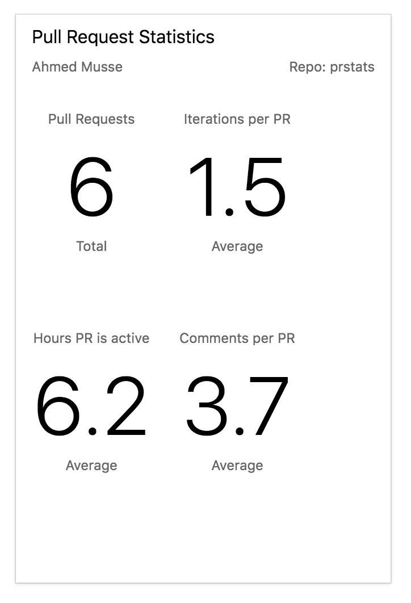
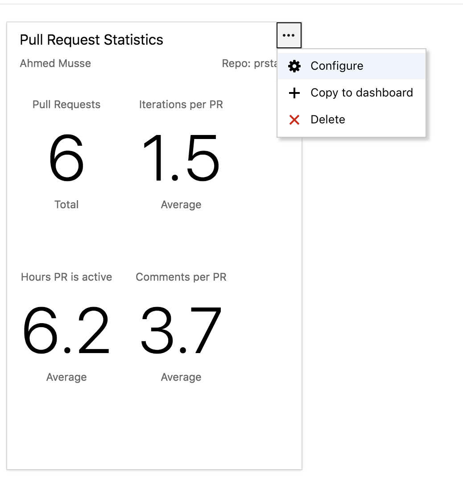
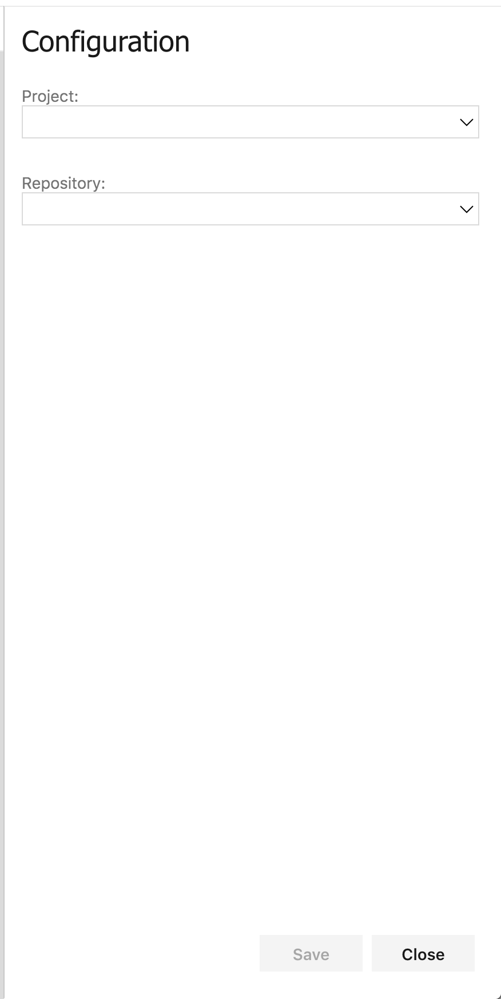

The Pull Request Statistics widget provides some statistics like number of pull requests, average number of iterations per pull request, average number of comments per pull request, and average number of hours a pull request is active.

This widget allows you to generate these statistics for every repository within a project. 

## Pull Request Statistics

This extension adds a new widget in your teams dashboard. The statistics that are shown are for the current logged in user.

The widget can be configured to any repository.

Just select the Azure DevOps project and the repository.

